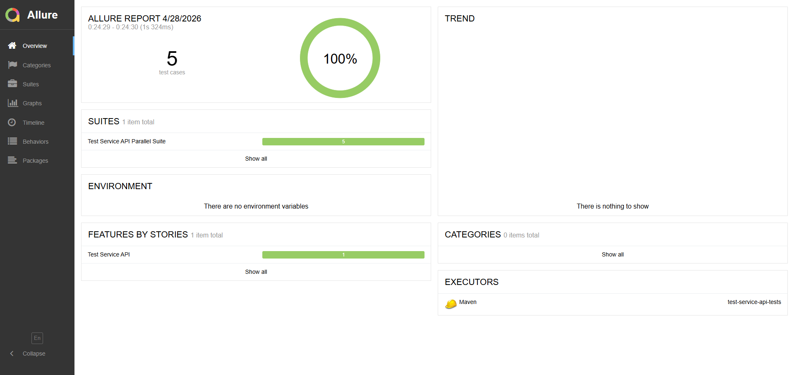
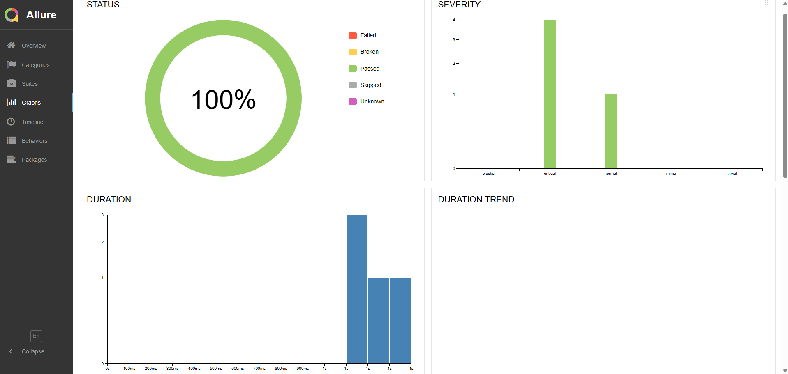
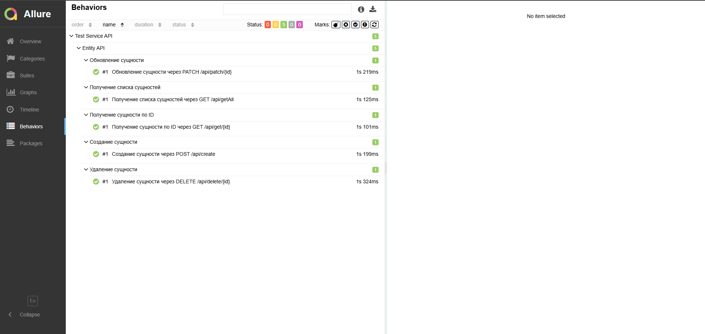

# test-service-api-tests

Проект содержит API-автотесты для сервиса [`test-service`](https://github.com/sun6r0/test-service).

## Стек технологий

- Java 17
- Maven
- TestNG
- Rest Assured
- Jackson
- Lombok
- Owner
- Allure
- Docker Compose
- GitHub Actions

## Что проверяется

Реализованы положительные API-автотесты для всех основных точек доступа приложения:

| Метод | Endpoint | Описание |
|---|---|---|
| POST | `/api/create` | Создание сущности |
| GET | `/api/get/{id}` | Получение сущности по ID |
| GET | `/api/getAll` | Получение списка сущностей |
| PATCH | `/api/patch/{id}` | Обновление сущности |
| DELETE | `/api/delete/{id}` | Удаление сущности |

## Обычный запуск автотестов

`.\mvnw.cmd clean test`

## Параллельный запуск

`.\mvnw.cmd clean test "-DsuiteXmlFile=testng-parallel.xml"`

## Скриншот Allure-отчёта

Создание отчёта: `.\mvnw.cmd allure:report`

